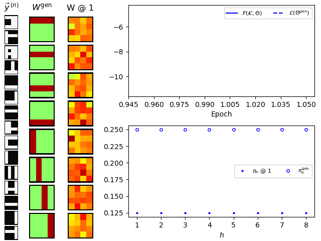

# Standard Bars Test




## Requirements
To run this example, make sure to have completed the installation instructions [described here](/../../README.md) and to have the `tvo` environment activated.

```bash
conda activate tvo
```


## Get started
To start the experiment, run `python main.py <model>` with `<model>` being one of `nor` or `bsc`. To see possible options, run, e.g., 

```bash
$ python main.py nor -h           
usage: Standard Bars Test nor [-h] [--output_directory OUTPUT_DIRECTORY] [-H_gen H_GEN]
                              [--bar_amp BAR_AMP] [--no_data_points NO_DATA_POINTS] [--Ksize KSIZE]
                              [--selection {fitness,uniform}] [--crossover]
                              [--no_parents NO_PARENTS] [--no_children NO_CHILDREN]
                              [--no_generations NO_GENERATIONS] [--no_epochs NO_EPOCHS]
                              [--viz_every VIZ_EVERY] [--gif_framerate GIF_FRAMERATE]
                              [--pi_gen PI_GEN] [-H H]

optional arguments:
  -h, --help            show this help message and exit
  --output_directory OUTPUT_DIRECTORY
                        Directory to write training output and visualizations to (will be output/<TIMESTAMP> if not specified) (default: None)
  -H_gen H_GEN          Number of bars used to generate data (default: 8)
  --bar_amp BAR_AMP     Bar amplitude (default: 1.0)
  --no_data_points NO_DATA_POINTS
                        Number of datapoints (default: 500)
  --Ksize KSIZE         Size of the K sets (i.e., S=|K|) (default: 10)
  --selection {fitness,uniform}
                        Selection operator (default: fitness)
  --crossover           Whether to apply crossover. Must be False if no_children is specified.
                        (default: False)
  --no_parents NO_PARENTS
                        Number of parental states to select per generation (default: 5)
  --no_children NO_CHILDREN
                        Number of children to evolve per generation (default: 3)
  --no_generations NO_GENERATIONS
                        Number of generations to evolve (default: 2)
  --no_epochs NO_EPOCHS
                        Number of epochs to train (default: 40)
  --viz_every VIZ_EVERY
                        Create visualizations every X'th epoch. Set to no_epochs if not specified.
                        (default: 1)
  --gif_framerate GIF_FRAMERATE
                        Frames per second for gif animation (e.g., 2/1 for 2 fps). If not
                        specified, no gif will be produced. (default: None)
  --pi_gen PI_GEN       Sparsity used for data generation (defaults to 2/H if not specified)
                        (default: None)
  -H H                  Number of generative fields to learn (set to H_gen if not specified)
                        (default: None)
```


## Distributed execution

For distributed execution on multiple CPU cores (requires MPI to be installed), run with `mpirun -n <n_proc> python ...`. For example, to run the NoisyOR example on four cores, run:

```bash
env TVEM_MPI=1 mpirun -n 4 python main.py nor
```

To run on GPU (requires cudatoolkit to be installed), run, e.g.:

```bash
env TVEM_GPU=0 python main.py nor
```


# Reference
[1] "Evolutionary Variational Optimization of Generative Models", Jakob Drefs, Enrico Guiraud, Jörg Lücke. Journal of Machine Learning Research, in press, 2022. Pointer will follow, see [here](https://arxiv.org/abs/2012.12294) for a preliminary arXiv version.