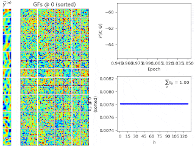

# Feature Learning on Whitened Image Patches



Learning $`H=128`$ generative fields (GFs) from $`N=5000`$ ZCA-whitened [1,2] patches extracted from a randomly chosen image from the van Hateren's Natural Image Dataset [3] using EBSC [4].


## Requirements
To run this example, make sure to have completed the installation instructions [described here](../../README.md) and to have the `tvo` environment activated.

```bash
conda activate tvo
```

The example additionally requires `ffmpeg`, `tifffile`, `imageio`, and `tvutil` to be installed (for details on tvutil see [here](https://github.com/tvlearn/tvutil)). 


## Get started
To start the experiment, run `python main.py`. To see possible options, run, e.g.:

```bash
usage: main.py [-h] [--image_file IMAGE_FILE] [--patch_size PATCH_SIZE PATCH_SIZE] [--no_patches NO_PATCHES]
               [--output_directory OUTPUT_DIRECTORY] [-H H] [--Ksize KSIZE] [--selection {fitness,uniform}]
               [--crossover] [--no_parents NO_PARENTS] [--no_children NO_CHILDREN]
               [--no_generations NO_GENERATIONS] [--no_epochs NO_EPOCHS] [--viz_every VIZ_EVERY]
               [--gif_framerate GIF_FRAMERATE]

Train EBSC on whitened image patches

optional arguments:
  -h, --help            show this help message and exit
  --image_file IMAGE_FILE
                        Full path to image file (.png, .jpg, .tiff, ...) used to extract training patches
                        (default: ./data/image.tiff)
  --patch_size PATCH_SIZE PATCH_SIZE
                        Patch size, (height, width) tuple (default: (10, 10))
  --no_patches NO_PATCHES
                        Number of image patches to extract for training (default: 5000)
  --output_directory OUTPUT_DIRECTORY
                        Directory to write training output and visualizations to (will be output/<TIMESTAMP> if
                        not specified) (default: None)
  -H H                  Number of generative fields to learn (default: 128)
  --Ksize KSIZE         Size of the K sets (i.e., S=|K|) (default: 10)
  --selection {fitness,uniform}
                        Selection operator (default: fitness)
  --crossover           Whether to apply crossover. Must be False if no_children is specified (default: False)
  --no_parents NO_PARENTS
                        Number of parental states to select per generation (default: 5)
  --no_children NO_CHILDREN
                        Number of children to evolve per generation (default: 3)
  --no_generations NO_GENERATIONS
                        Number of generations to evolve (default: 2)
  --no_epochs NO_EPOCHS
                        Number of epochs to train (default: 300)
  --viz_every VIZ_EVERY
                        Create visualizations every Xth epoch. Set to no_epochs if not specified. (default: 1)
  --gif_framerate GIF_FRAMERATE
                        If specified, the training output will be additionally saved as animated gif. The
                        framerate is given in frames per second. If not specified, no gif will be produced.
                        (default: None)
```


## Distributed execution

For distributed execution on multiple CPU cores (requires MPI to be installed), run with `mpirun -n <n_proc> python main.py ...`, e.g.:

```bash
env TVO_MPI=1 mpirun -n 4 python main.py
```

To run on GPU (requires cudatoolkit to be installed), run, e.g.:

```bash
env TVO_GPU=0 python main.py
```


# Note
The default hyperparameters in this examples are chosen s.t. examplary executions of the algorithm on a standard personal computer can be performed in short time. For larger training datasets and improved performance, larger models and, in turn, larger compute ressources (on the order of hundreds of CPU cores) are required. For details, see [4].


# Reference
[1] The “independent components” of natural scenes are edge filters. A. J. Bell and T. J. Sejnowski. _Vision Research_, 37(23):3327–38, 1997.

[2] Discrete Sparse Coding. G. Exarchakis and J. Lücke. _Neural Computation_, 29:2979–3013, 2017.

[3] Independent Component Filters of Natural Images Compared with Simple Cells in Primary Visual Cortex. J. H. van Hateren and A. van der Schaaf. _Proceedings: Biological Sciences_ 265(1394):359-366, 1998.

[4] Evolutionary Variational Optimization of Generative Models. Jakob Drefs, Enrico Guiraud, Jörg Lücke. _Journal of Machine Learning Research_ 23(21):1-51, 2022. [(online access)](https://www.jmlr.org/papers/v23/20-233.html)
