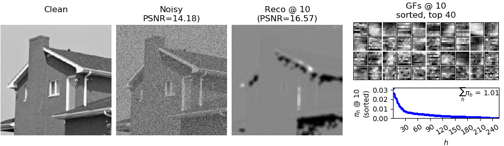

# Gaussian Denoising



Denoising House (σ=50) with EBSC using $`D=8\times8`$ image patches and $`H=256`$ individual priors (compare [1] for details).


## Requirements
To run this example, make sure to have completed the installation instructions [described here](/../../README.md) and to have the `tvo` environment activated.

```bash
conda activate tvo
```

The example additionally requires `ffmpeg`, `imageio`, and `tvutil` to be installed (for details on tvutil see [here](https://github.com/tvlearn/tvutil)). 


## Get started
To start the experiment, run `python main.py`. To see possible options, run, e.g.:

```bash
$ python main.py -h           
usage: main.py [-h] [--clean_image CLEAN_IMAGE] [--rescale RESCALE] [--noise_level NOISE_LEVEL]
               [--patch_height PATCH_HEIGHT] [--patch_width PATCH_WIDTH] [--Ksize KSIZE]
               [--selection {fitness,uniform}] [--crossover] [--no_parents NO_PARENTS]
               [--no_children NO_CHILDREN] [--no_generations NO_GENERATIONS] [-H H] [--no_epochs NO_EPOCHS]
               [--merge_every MERGE_EVERY] [--output_directory OUTPUT_DIRECTORY] [--viz_every VIZ_EVERY]
               [--gif_framerate GIF_FRAMERATE]

Gaussian Denoising with BSC

optional arguments:
  -h, --help            show this help message and exit
  --clean_image CLEAN_IMAGE
                        Full path to clean image (png, jpg, ... file) (default: ./img/house.png)
  --rescale RESCALE     If specified, the size of the clean image will be rescaled by this factor (only for
                        demonstration purposes to minimize computational effort) (default: 0.5)
  --noise_level NOISE_LEVEL
                        Standard deviation of the additive white Gaussian noise (default: 25)
  --patch_height PATCH_HEIGHT
                        Patch height (default: 5)
  --patch_width PATCH_WIDTH
                        Patch width (defaults to patch_height if not specified) (default: None)
  --Ksize KSIZE         Size of the K sets (i.e., S=|K|) (default: 50)
  --selection {fitness,uniform}
                        Selection operator (default: fitness)
  --crossover           Whether to apply crossover. Must be False if no_children is specified (default:
                        False)
  --no_parents NO_PARENTS
                        Number of parental states to select per generation (default: 20)
  --no_children NO_CHILDREN
                        Number of children to evolve per generation (default: 2)
  --no_generations NO_GENERATIONS
                        Number of generations to evolve (default: 1)
  -H H                  Number of generative fields to learn (dictionary size) (default: 32)
  --no_epochs NO_EPOCHS
                        Number of epochs to train (default: 40)
  --merge_every MERGE_EVERY
                        Generate reconstructed image by merging image patches every Xth epoch (will be set
                        equal to viz_every if not specified) (default: None)
  --output_directory OUTPUT_DIRECTORY
                        Directory to write H5 training output and visualizations to (will be
                        output/<TIMESTAMP> if not specified) (default: None)
  --viz_every VIZ_EVERY
                        Create visualizations every Xth epoch. (default: 1)
  --gif_framerate GIF_FRAMERATE
                        If specified, the training output will be additionally saved as animated gif. The
                        framerate is given in frames per second. If not specified, no gif will be produced.
                        (default: None)
```


## Distributed execution

For distributed execution on multiple CPU cores (requires MPI to be installed), run with `mpirun -n <n_proc> python main.py ...`, e.g.:

```bash
env TVO_MPI=1 mpirun -n 4 python main.py
```

To run on GPU (requires cudatoolkit to be installed), run, e.g.:

```bash
env TVO_GPU=0 python main.py
```


# Note
The default hyperparameters in this examples are chosen s.t. examplary executions of the algorithm on a standard personal computer can be performed in short time. For full resolution images and improved performance, larger models and, in turn, larger compute ressources (on the order of hundreds of CPU cores) are required. For details, see [1]. 


# Reference
[1] "Evolutionary Variational Optimization of Generative Models", Jakob Drefs, Enrico Guiraud, Jörg Lücke. Journal of Machine Learning Research, in press, 2022. Pointer will follow, see [here](https://arxiv.org/abs/2012.12294) for a preliminary arXiv version.